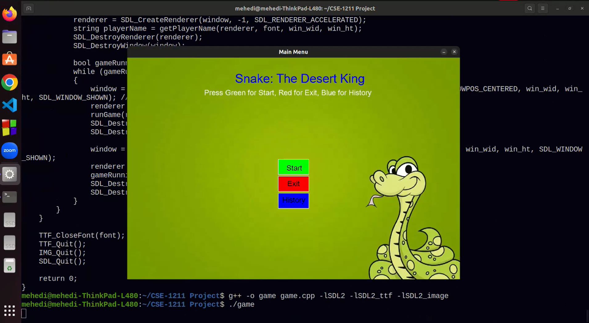

# 🐍 Snake Game Project

**Course**: CSE-1211 | **Institution**: University of Dhaka  
**Developer**: Mehedi Hasan

A classic Snake game built using C++ and the SDL2 library as a final project for the second semester of the first year. This game includes features such as player history, name input, and best score tracking.

---

## 📜 About the Project

This project recreates the timeless Snake game, where players control a snake that grows longer by consuming food items while avoiding collisions with itself and screen borders. It runs offline in single-player mode, keeping a record of player history and the highest score.

---
## 🖼️ Screenshots

### Main Menu


### Gameplay


---

## 🎮 Features

- **Single-player gameplay**: Enjoy a classic offline game mode where you control a snake.
- **Player Name Input**: Input and save your name along with your score.
- **Score History**: Keep track of scores from previous games.
- **Best Score Display**: See the highest score achieved across all games.
- **Offline Play**: No internet connection required.

---

## 🛠️ Tools, Technologies, and Frameworks Used

- **C++ Programming Language**: Handles core game logic and functionality.
- **SDL2 Library**: Powers graphics and input handling.
  - **SDL2_ttf**: Renders text elements, such as scores and player names.
  - **SDL2_image**: Manages images for game graphics.

---

## 🚀 How to Run the Game

1. **Install SDL2 and Dependencies**: Ensure SDL2, SDL2_ttf, and SDL2_image are installed on your system.
2. **Compile the Code**: Use a C++ compiler with SDL2 linked. For example:
   ```sh
   g++ -o SnakeGame main.cpp -lSDL2 -lSDL2_ttf -lSDL2_image
